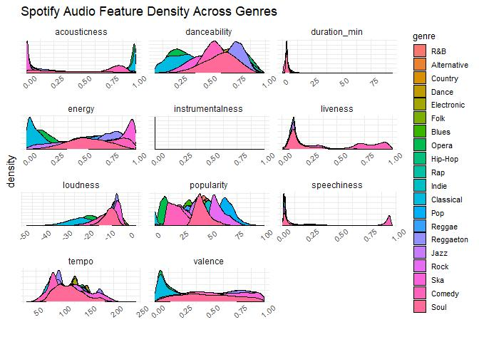
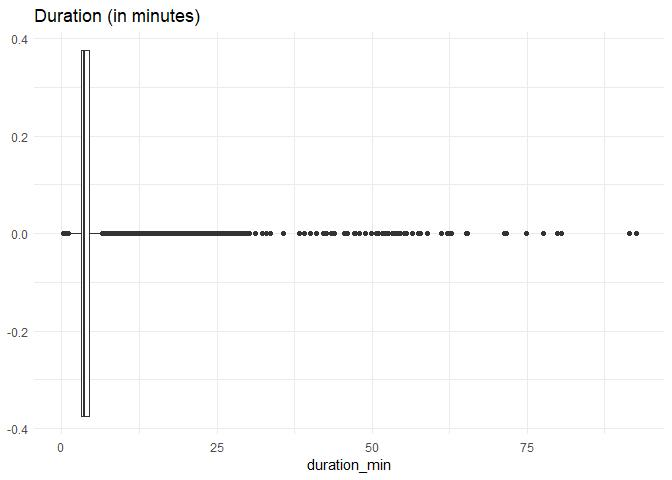
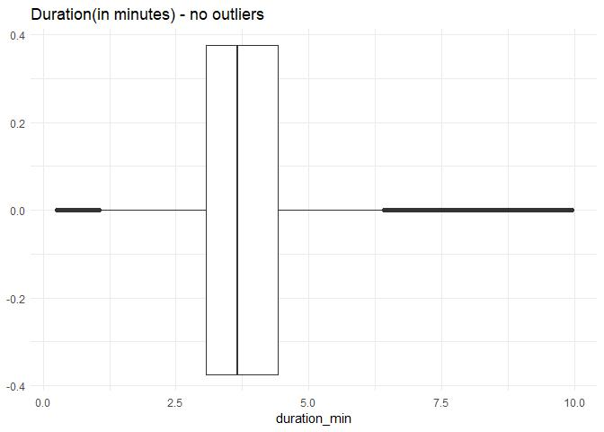
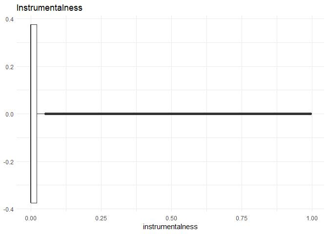
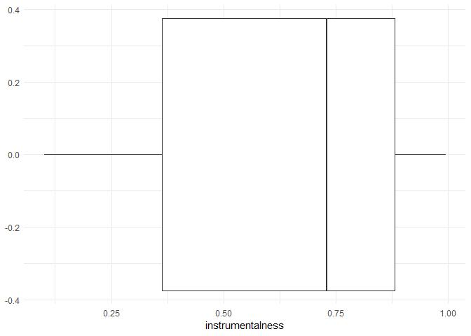
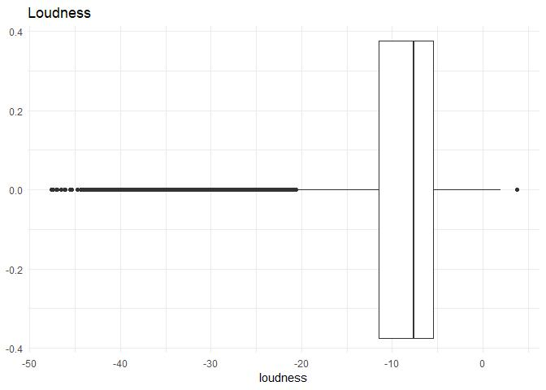
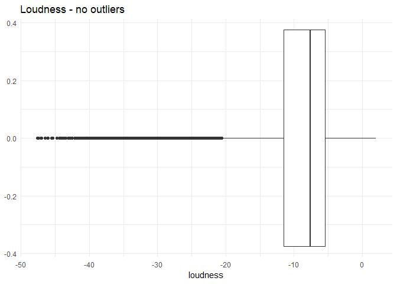
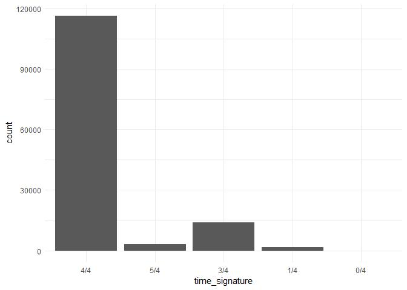
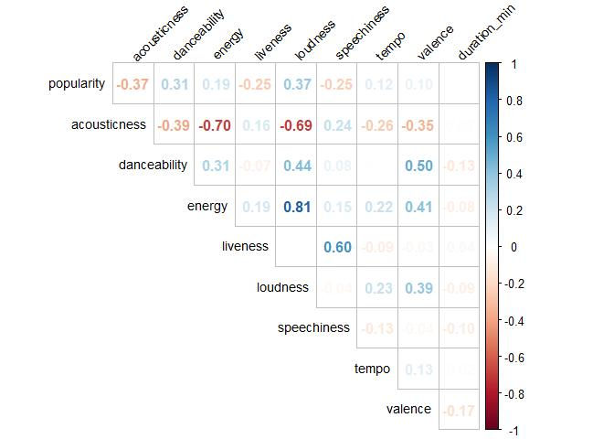

Spotify Predictive Analysis
================
Alejandro Cepeda
5/23/2022

***GRAMMAR CHECK ALL MARKDOWN TEXT BEFORE UPLOADING***

## Context


Music (listening and playing) is one of my favorites pastimes and go-to
therapy session to de-stress. From a very young age, I have always
enjoyed diverse genres of music, which then prompted me to search for
and discover new genres I may enjoy. That of course could be a hit or
miss depending on what I discover. To combat the struggle of manually
conducting searches for new or previously unknown genres of music, I ask
the following question: **What determines a track’s genre category?**.
Knowing this may help me determine what makes a track enjoyable or not
based on my own tastes and hopefully others who read this! To answer
this, I downloaded a Spotify dataset from
[Kaggle.com](https://www.kaggle.com/datasets/zaheenhamidani/ultimate-spotify-tracks-db),
which was gathered using the Spotify API, mined and saved by Kaggle user
Zaheen Hamidani. This dataset contains track information and the audio
features associated with their respective track, sourced from Spotify’s
API
[documentation](https://developer.spotify.com/documentation/web-api/reference/#/operations/get-audio-features):

## Data Description

-   **genre**: Song genre
-   **artist_name**: Song artist
-   **track_name**: Song name
-   **track_id**: Song unique ID
-   **popularity**: Song popularity (0-100) where higher is better
-   **acousticness**: A confidence measure from 0.0 to 1.0 of whether
    the track is acoustic. 1.0 represents high confidence the track is
    acoustic.
-   **danceability**: Describes how suitable a track is for dancing
    based on a combination of musical elements including tempo, rhythm
    stability, beat strength, and overall regularity. A value of 0.0 is
    least danceable and 1.0 is most danceable.
-   **duration_ms**: Duration of track in milliseconds
-   **energy**: Energy is a measure from 0.0 to 1.0 and represents a
    perceptual measure of intensity and activity. Typically, energetic
    tracks feel fast, loud, and noisy. For example, death metal has high
    energy, while a Bach prelude scores low on the scale. Perceptual
    features contributing to this attribute include dynamic range,
    perceived loudness, timbre, onset rate, and general entropy.
-   **instrumentalness**: Predicts whether a track contains no vocals.
    “Ooh” and “aah” sounds are treated as instrumental in this context.
    Rap or spoken word tracks are clearly “vocal”. The closer the
    instrumentalness value is to 1.0, the greater likelihood the track
    contains no vocal content. Values above 0.5 are intended to
    represent instrumental tracks, but confidence is higher as the value
    approaches 1.0.
-   **key**: The estimated overall key of the track. Integers map to
    pitches using standard Pitch Class notation . E.g. 0 = C, 1 = C#/D#,
    2 = D, and so on. If no key was detected, the value is -1.
-   **liveness**: Detects the presence of an audience in the recording.
    Higher liveness values represent an increased probability that the
    track was performed live. A value above 0.8 provides strong
    likelihood that the track is live.
-   **loudness**: The overall loudness of a track in decibels (dB).
    Loudness values are averaged across the entire track and are useful
    for comparing relative loudness of tracks. Loudness is the quality
    of a sound that is the primary psychological correlate of physical
    strength (amplitude). Values typical range between -60 and 0 db.
-   **mode**: Mode indicates the modality (major or minor) of a track,
    the type of scale from which its melodic content is derived. Major
    is represented by 1 and minor is 0.
-   **speechiness**: Speechiness detects the presence of spoken words in
    a track. The more exclusively speech-like the recording (e.g. talk
    show, audio book, poetry), the closer to 1.0 the attribute value.
    Values above 0.66 describe tracks that are probably made entirely of
    spoken words. Values between 0.33 and 0.66 describe tracks that may
    contain both music and speech, either in sections or layered,
    including such cases as rap music. Values below 0.33 most likely
    represent music and other non-speech-like tracks.
-   **tempo**: The overall estimated tempo of a track in beats per
    minute (BPM). In musical terminology, tempo is the speed or pace of
    a given piece and derives directly from the average beat duration.
-   **time_signature**: A measurement used in music to indicate meter,
    written as a fraction with the bottom number indicating the kind of
    note used as a unit of time and the top number indicating the number
    of units in each measure.
-   **valence**: A measure from 0.0 to 1.0 describing the musical
    positiveness conveyed by a track. Tracks with high valence sound
    more positive (e.g. happy, cheerful, euphoric), while tracks with
    low valence sound more negative (e.g. sad, depressed, angry).

## Packages and Data Collection

The following are the packages used throughout this project:

``` r
# libraries
library(tidyverse)
library(corrplot)
library(caret)
library(randomForest)
```

Let’s read in the dataset from the working directory:

``` r
# read in data
spotify <- read_csv("SpotifyFeatures.csv", show_col_types = FALSE)
glimpse(spotify)
```

    ## Rows: 232,725
    ## Columns: 18
    ## $ genre            <chr> "Movie", "Movie", "Movie", "Movie", "Movie", "Movie",~
    ## $ artist_name      <chr> "Henri Salvador", "Martin & les fées", "Joseph Willia~
    ## $ track_name       <chr> "C'est beau de faire un Show", "Perdu d'avance (par G~
    ## $ track_id         <chr> "0BRjO6ga9RKCKjfDqeFgWV", "0BjC1NfoEOOusryehmNudP", "~
    ## $ popularity       <dbl> 0, 1, 3, 0, 4, 0, 2, 15, 0, 10, 0, 2, 4, 3, 0, 0, 0, ~
    ## $ acousticness     <dbl> 0.61100, 0.24600, 0.95200, 0.70300, 0.95000, 0.74900,~
    ## $ danceability     <dbl> 0.389, 0.590, 0.663, 0.240, 0.331, 0.578, 0.703, 0.41~
    ## $ duration_ms      <dbl> 99373, 137373, 170267, 152427, 82625, 160627, 212293,~
    ## $ energy           <dbl> 0.9100, 0.7370, 0.1310, 0.3260, 0.2250, 0.0948, 0.270~
    ## $ instrumentalness <dbl> 0.00e+00, 0.00e+00, 0.00e+00, 0.00e+00, 1.23e-01, 0.0~
    ## $ key              <chr> "C#", "F#", "C", "C#", "F", "C#", "C#", "F#", "C", "G~
    ## $ liveness         <dbl> 0.3460, 0.1510, 0.1030, 0.0985, 0.2020, 0.1070, 0.105~
    ## $ loudness         <dbl> -1.828, -5.559, -13.879, -12.178, -21.150, -14.970, -~
    ## $ mode             <chr> "Major", "Minor", "Minor", "Major", "Major", "Major",~
    ## $ speechiness      <dbl> 0.0525, 0.0868, 0.0362, 0.0395, 0.0456, 0.1430, 0.953~
    ## $ tempo            <dbl> 166.969, 174.003, 99.488, 171.758, 140.576, 87.479, 8~
    ## $ time_signature   <chr> "4/4", "4/4", "5/4", "4/4", "4/4", "4/4", "4/4", "4/4~
    ## $ valence          <dbl> 0.8140, 0.8160, 0.3680, 0.2270, 0.3900, 0.3580, 0.533~

## Data Preparation

Prior to conducting EDA, there is already some preexisting knowledge
regarding the variables within the dataframe. Since this data was
gathered using an API, it is always a good practice to check for
duplicate observations (or rows) to ensure uniformity. The variables
`artist_name`, `track_name`, and `track_id` will not be needed for the
purpose of this project, thus the best course of action may be to remove
them. To conduct all of these data cleaning steps, I created a pipeline
using the dplyr’s `%>%` operator (loaded from the tidyverse package).

``` r
# pipeline to clean, drop and reformat variables
spotify_clean <- spotify %>%
  # remove duplicate tracks
  distinct(track_id, .keep_all=TRUE) %>%
  # select relevant variables
  select(-c(artist_name, track_name, track_id)) %>%
  # convert character variables to factor
  mutate(genre = as_factor(genre),
         time_signature = as_factor(time_signature),
         # convert duration to minutes instead
         duration_min = duration_ms/60000) %>%
  select(-duration_ms)
```

Based on prior musical knowledge (guitar and percussion classes), I
decided it is best to exclude `key`, `mode`, and `time_signature` from
the dataframe as they do not properly distinguish a genre as their
measurements often overlap, regardless of how a track sounds. The key,
as described in the [data description](#description), measures the pitch
the track was recorded in, which often only changes how high or low the
pitch will sound. The mode, labelled as either major or minor, may not
be specific enough for the classification models to properly
differentiate one from the other to predict a music genre. Time
signature will be used for further analysis as the tempo in which a
track is played may be useful for classifying a genre.

``` r
# drop mode and time signature
spotify_clean <- spotify_clean %>%
  select(-c(key, mode))
```

Before proceeding any further, inspecting the genres within the
dataframe may be helpful in the case of a misleading genre being
present.

``` r
# ensure genres are properly written
levels(spotify_clean$genre)
```

    ##  [1] "Movie"            "R&B"              "A Capella"        "Alternative"     
    ##  [5] "Country"          "Dance"            "Electronic"       "Anime"           
    ##  [9] "Folk"             "Blues"            "Opera"            "Hip-Hop"         
    ## [13] "Children's Music" "Children’s Music" "Rap"              "Indie"           
    ## [17] "Classical"        "Pop"              "Reggae"           "Reggaeton"       
    ## [21] "Jazz"             "Rock"             "Ska"              "Comedy"          
    ## [25] "Soul"             "Soundtrack"       "World"

``` r
# recode Children's Music genres as one
levels(spotify_clean$genre)[levels(spotify_clean$genre) == "Children’s Music"] <- "Children's Music"

# verify recoding of levels
levels(spotify_clean$genre)
```

    ##  [1] "Movie"            "R&B"              "A Capella"        "Alternative"     
    ##  [5] "Country"          "Dance"            "Electronic"       "Anime"           
    ##  [9] "Folk"             "Blues"            "Opera"            "Hip-Hop"         
    ## [13] "Children's Music" "Rap"              "Indie"            "Classical"       
    ## [17] "Pop"              "Reggae"           "Reggaeton"        "Jazz"            
    ## [21] "Rock"             "Ska"              "Comedy"           "Soul"            
    ## [25] "Soundtrack"       "World"

Success! We can now continue with our cleaning process.

As the final step of the cleaning process, let’s check for any missing
values:

``` r
# check for missing data
colSums(is.na(spotify_clean))
```

    ##            genre       popularity     acousticness     danceability 
    ##                0                0                0                0 
    ##           energy instrumentalness         liveness         loudness 
    ##                0                0                0                0 
    ##      speechiness            tempo   time_signature          valence 
    ##                0                0                0                0 
    ##     duration_min 
    ##                0

Great news, 0 NAs were found!

## Exploratory Data Analysis

Now that our data is clean, we can conduct some EDA and determine
whether any further manipulation to be made on the data as well as
selecting the most appropriate features for the models.

``` r
# number of tracks per genre
spotify_clean %>%
  group_by(genre) %>%
  count() %>%
  arrange(n)
```

    ## # A tibble: 26 x 2
    ## # Groups:   genre [26]
    ##    genre                n
    ##    <fct>            <int>
    ##  1 A Capella          119
    ##  2 Rap               1456
    ##  3 Rock              2227
    ##  4 Pop               2417
    ##  5 Indie             3318
    ##  6 Soul              4430
    ##  7 R&B               5353
    ##  8 Children's Music  6741
    ##  9 Country           7383
    ## 10 Hip-Hop           7413
    ## # ... with 16 more rows

``` r
# reorder variables
spotify_clean <- spotify_clean %>%
  # remove A Capella from data
  filter(!genre %in% c("A Capella","Anime","Children's Music","Movie","Soundtrack","World")) %>%
  droplevels() %>%
  select(genre, time_signature, everything())
```

### Feature Analysis/Engineering

To ensure the data possesses proper center and spread, let’s take a look
at each possible features by genre. First let’s visualize the
distribution of each possible feature across all genres in the
dataframe:

``` r
# store numeric variable names in a vector
feature_names <- names(spotify_clean)[3:13]

# density plot of numeric features by genre
spotify_clean %>%
  select(c(genre, feature_names)) %>%
  # convert data to long format based on features
  pivot_longer(cols = feature_names) %>%
  ggplot(aes(x = value, fill = genre)) +
  geom_density() +
  facet_wrap(~name, ncol = 3, scales = "free") +
  labs(title = "Spotify Audio Feature Density Across Genres",
       x = "", y = "density") +
  theme(axis.text.x = element_text(size = 8, angle = 40),
        axis.text.y = element_blank(),
        legend.title = element_text(size=10),
        legend.key.size = unit(5, "mm"),
        legend.text = element_text(size=8))
```

<!-- -->

Based on the density plots above, `duration_min`, `instrumentalness`,
and `loudness` require normalization to ensure a well distributed
dataframe.

**Track Duration**

``` r
# look for outliers
spotify_clean %>%
  ggplot(aes(y = duration_min)) +
  geom_boxplot() + 
  coord_flip() +
  ggtitle("Duration (in minutes)")
```

<!-- -->

``` r
# store outliers based on 4th whisker
duration_outliers <- boxplot(spotify_clean$duration_min, 
                             plot = FALSE, range = 4)$out

# remove outliers
spotify_clean <- spotify_clean %>%
  filter(!duration_min %in% duration_outliers)

spotify_clean %>%
  ggplot(aes(y = duration_min)) +
  geom_boxplot() + 
  coord_flip() +
  ggtitle("Duration(in minutes) - no outliers")
```

<!-- -->

**Instrumentalness**

``` r
# look for outliers
spotify_clean %>%
  ggplot(aes(y = instrumentalness)) +
  geom_boxplot() +
  coord_flip() +
  ggtitle("Instrumentalness")
```

<!-- -->

``` r
# compare data w/ and w/o instrumentalness > 0
spotify_clean %>%
  filter(instrumentalness > 0.1) %>%
  ggplot(aes(y = instrumentalness)) +
  geom_boxplot() +
  coord_flip()
```

<!-- -->

``` r
# add all tracks w/o instrumentalness by genre
spotify_clean %>% 
  group_by(genre) %>%
  summarize(sum(instrumentalness == 0))
```

    ## # A tibble: 20 x 2
    ##    genre       `sum(instrumentalness == 0)`
    ##    <fct>                              <int>
    ##  1 R&B                                 2579
    ##  2 Alternative                         2573
    ##  3 Country                             3596
    ##  4 Dance                               4147
    ##  5 Electronic                           403
    ##  6 Folk                                1576
    ##  7 Blues                               1385
    ##  8 Opera                                484
    ##  9 Hip-Hop                             4835
    ## 10 Rap                                  956
    ## 11 Indie                                940
    ## 12 Classical                            320
    ## 13 Pop                                 1361
    ## 14 Reggae                              3518
    ## 15 Reggaeton                           5101
    ## 16 Jazz                                 813
    ## 17 Rock                                 635
    ## 18 Ska                                 2327
    ## 19 Comedy                              8116
    ## 20 Soul                                1252

From the yielded results above, I will remove `instrumentalness` as a
predictor variable due to the little influence it shows in terms of
classifying a genre.

``` r
spotify_clean <- spotify_clean %>%
  select(-instrumentalness)
```

**Loudness**

``` r
# look for outliers
spotify_clean %>%
  ggplot(aes(y = loudness)) +
  geom_boxplot() +
  coord_flip() +
  ggtitle("Loudness")
```

<!-- -->

``` r
# remove outliers
spotify_clean <- spotify_clean %>%
  filter(loudness < max(loudness))

# boxplot without outlier
spotify_clean %>%
  ggplot(aes(y = loudness)) +
  geom_boxplot() +
  coord_flip() +
  ggtitle("Loudness - no outliers")
```

<!-- -->

**Time Signature**

``` r
# plot time_signature distribution
spotify_clean %>%
  ggplot(aes(x=time_signature)) +
  geom_bar()
```

<!-- -->

As can be seen in the plot above, a substantial number of tracks were
recorded to be in `4/4` meter, which can cause great bias during the
model training process. Based on inference and industry knowledge, I
will remove `time_signature` from the dataframe.

``` r
# drop time_signature
spotify_clean <- spotify_clean %>%
  select(-time_signature)
```

### Correlation

The final step prior to the modeling process is to find any features to
exclude with the help of a visualization of the correlations across all
numerical features. What we are looking for here are associations
between the features so any bias between multiple variables are avoided
when training and testing our model.

``` r
# correlation plot of numeric features
spotify_clean %>%
  select(-c(genre)) %>% 
  cor() %>%
  corrplot(method="number", type="upper", diag=FALSE,
           tl.col = "black", tl.cex=0.9, tl.srt=45)
```

<!-- -->
Loudness and energy possess the highest positive correlation (0.81),
therefore one must go in order to avoid prediction bias. Since `energy`
is much more evenly distributed compared to `loudness`, the latter will
be dropped from the final version of the full data frame.

``` r
# remove loudness
spotify_final <- spotify_clean %>%
  select(-loudness)
```

## Train/Test Split

``` r
# creating index and creating train/test split
set.seed(123)
index <- createDataPartition(spotify_final$genre, p=0.80, list=FALSE)
spotify_train <- spotify_final[index,]
spotify_test <- spotify_final[-index,]

# training control for models
ctrl <- trainControl(method="cv", number=10)
```

## Modeling

### Nearest Neighbors

``` r
# build training model
knn_model <- train(genre~., spotify_train, 
                   method="knn",
                   trControl=trainControl(method="none"),
                   preProcess=c("center","scale"))
knn_model

# build cv model
knn_cv <- train(genre~., spotify_train, 
                   method="knn",
                   trControl=ctrl,
                   preProcess=c("center","scale"))
knn_cv
```

**Predictions**

``` r
# predict on models
knn_train_pred <- predict(knn_model, spotify_train) # train set
knn_test_pred <- predict(knn_model, spotify_test) # test set
knn_cv_pred <- predict(knn_cv, spotify_train) # cv
```

**Model Performance**

``` r
# knn confusion matrices
knn_train_cm <- confusionMatrix(knn_train_pred, spotify_train$genre) # train set
knn_test_cm <- confusionMatrix(knn_test_pred, spotify_test$genre) # test set
knn_cv_cm <- confusionMatrix(knn_cv_pred, spotify_train$genre) # cv

# compare performances
print(knn_train_cm)
print(knn_test_cm)
print(knn_cv_cm)
```

### Random Forest

``` r
# build training model
rf_model <- train(genre~., spotify_train, 
                   method="rf",
                   trControl=trainControl(method="none"),
                   preProcess=c("center","scale"))
rf_model

# build cv model
rf_cv <- train(genre~., spotify_train, 
                   method="rf",
                   trControl=ctrl,
                   preProcess=c("center","scale"))
rf_cv
```

**Predictions**

``` r
# predict on models
rf_train_pred <- predict(rf_model, spotify_train) # train set
rf_test_pred <- predict(rf_model, spotify_test) # test set
rf_cv_pred <- predict(rf_cv, spotify_train) # cv 
```

**Model Performance**

``` r
# random forest confusion matrices
rf_train_cm <- confusionMatrix(rf_train_pred, spotify_train$genre) # train set
rf_test_cm <- confusionMatrix(rf_test_pred, spotify_test$genre) # test set
rf_cv_cm <- confusionMatrix(rf_cv_pred, spotify_train$genre) # cv

# compare performances
print(rf_train_cm)
print(rf_test_cm)
print(rf_cv_cm)
```

### Gradient Boosting

``` r
# build training model
gbm_model <- train(genre~., spotify_train, 
                   method="gbm",
                   trControl=trainControl(method="none"),
                   preProcess=c("center","scale"))
gbm_model

# build cv model
gbm_cv <- train(genre~., spotify_train, 
                   method="gbm",
                   trControl=ctrl,
                   preProcess=c("center","scale"))
gbm_cv
```

**Predictions**

``` r
# predict on models
gbm_train_pred <- predict(gbm_model, spotify_train)# train set
gbm_test_pred <- predict(gbm_model, spotify_test) # test set
gbm_cv_pred <- predict(gbm_cv, spotify_train)# cv train set
```

**Model Performance**

``` r
# gbm confusion matrices
rf_train_cm <- confusionMatrix(rf_train_pred, spotify_train$genre)# train set
rf_test_cm <- confusionMatrix(rf_test_pred, spotify_test$genre) # test set
rf_cv_cm <- confusionMatrix(rf_cv_pred, spotify_train$genre)# cv train set

# compare performances
print(rf_train_cm)
print(rf_test_cm)
print(rf_cv_cm)
```

### Feature Importance

``` r
rf_importance <- varImp(rf_model)
```
