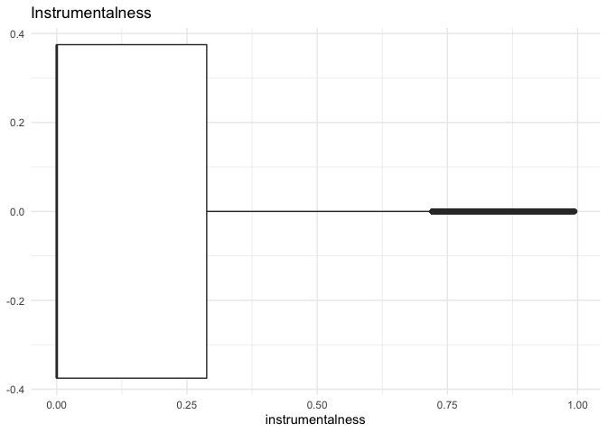
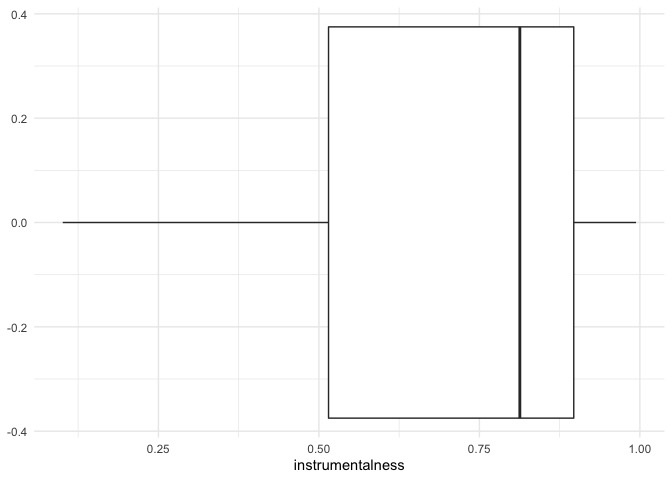
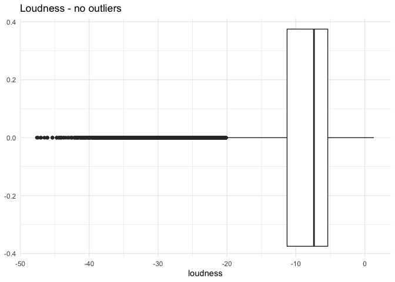
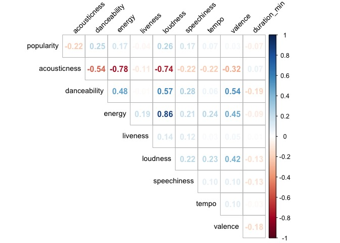

Spotify Predictive Analysis
================
Alejandro Cepeda
6/16/2022

## Context


Music (listening and playing) is one of my favorite pastimes and go-to
therapy session to de-stress. From a very young age, I have always
I enjoyed diverse genres of music, which then prompted me to search for
and discover new genres I may enjoy. That, of course, could be a hit or
depending on what I discover. To combat the struggle of manually
In conducting searches for new or previously unknown genres of music, I ask
The following question: **What determines a track’s genre category?**.
Knowing this may help me determine what makes a track enjoyable or not.
based on my own tastes and hopefully those of others who read this. To answer
this, I downloaded a Spotify dataset from
[Kaggle.com](https://www.kaggle.com/datasets/zaheenhamidani/ultimate-spotify-tracks-db),
which was gathered using the Spotify API, mined and saved by a Kaggle user,
Zaheen Hamidani. This dataset contains track information and the audio features
derived from Spotify's
API
[documentation](https://developer.spotify.com/documentation/web-api/reference/#/operations/get-audio-features):

## Data Description

-   **genre**: Song genre
-   **artist_name**: Song artist
-   **track_name**: Song name
-   **track_id**: Song unique ID
-   **popularity**: Song popularity (0-100) where higher is better
-   **acousticness**: A confidence measure from 0.0 to 1.0 of whether
    the track is acoustic. 1.0 represents high confidence the track is
    acoustic.
-   **danceability**: Describes how suitable a track is for dancing
    based on a combination of musical elements including tempo, rhythm
    stability, beat strength, and overall regularity. A value of 0.0 is
    least danceable and 1.0 is most danceable.
-   **duration_ms**: Duration of track in milliseconds
-   **energy**: Energy is a measure from 0.0 to 1.0 and represents a
    perceptual measure of intensity and activity. Typically, energetic
    tracks feel fast, loud, and noisy. For example, death metal has high
    energy, while a Bach prelude scores low on the scale. Perceptual
    features contributing to this attribute include dynamic range,
    perceived loudness, timbre, onset rate, and general entropy.
-   **instrumentalness**: Predicts whether a track contains no vocals.
    “Ooh” and “aah” sounds are treated as instrumental in this context.
    Rap or spoken word tracks are clearly “vocal”. The closer the
    instrumentalness value is to 1.0, the greater likelihood the track
    contains no vocal content. Values above 0.5 are intended to
    represent instrumental tracks, but confidence is higher as the value
    approaches 1.0.
-   **key**: The estimated overall key of the track. Integers map to
    pitches using standard Pitch Class notation . E.g. 0 = C, 1 = C#/D#,
    2 = D, and so on. If no key was detected, the value is -1.
-   **liveness**: Detects the presence of an audience in the recording.
    Higher liveness values represent an increased probability that the
    track was performed live. A value above 0.8 provides strong
    likelihood that the track is live.
-   **loudness**: The overall loudness of a track in decibels (dB).
    Loudness values are averaged across the entire track and are useful
    for comparing relative loudness of tracks. Loudness is the quality
    of a sound that is the primary psychological correlate of physical
    strength (amplitude). Values typical range between -60 and 0 db.
-   **mode**: Mode indicates the modality (major or minor) of a track,
    the type of scale from which its melodic content is derived. Major
    is represented by 1 and minor is 0.
-   **speechiness**: Speechiness detects the presence of spoken words in
    a track. The more exclusively speech-like the recording (e.g. talk
    show, audio book, poetry), the closer to 1.0 the attribute value.
    Values above 0.66 describe tracks that are probably made entirely of
    spoken words. Values between 0.33 and 0.66 describe tracks that may
    contain both music and speech, either in sections or layered,
    including such cases as rap music. Values below 0.33 most likely
    represent music and other non-speech-like tracks.
-   **tempo**: The overall estimated tempo of a track in beats per
    minute (BPM). In musical terminology, tempo is the speed or pace of
    a given piece and derives directly from the average beat duration.
-   **time_signature**: A measurement used in music to indicate meter,
    written as a fraction with the bottom number indicating the kind of
    note used as a unit of time and the top number indicating the number
    of units in each measure.
-   **valence**: A measure from 0.0 to 1.0 describing the musical
    positiveness conveyed by a track. Tracks with high valence sound
    more positive (e.g. happy, cheerful, euphoric), while tracks with
    low valence sound more negative (e.g. sad, depressed, angry).

## Packages and Data Collection

The following are the packages used throughout this project:

``` r
# libraries
library(tidyverse)
library(corrplot)
library(rsample)
library(broom)
library(yardstick)
library(nnet)
library(Metrics)
library(ranger)
library(tidymodels)
```

Let’s read in the dataset from the working directory:

``` r
# read in data
spotify <- read_csv("SpotifyFeatures.csv", show_col_types = FALSE)
glimpse(spotify)
```

    ## Rows: 232,725
    ## Columns: 18
    ## $ genre            <chr> "Movie", "Movie", "Movie", "Movie", "Movie", "Movie",…
    ## $ artist_name      <chr> "Henri Salvador", "Martin & les fées", "Joseph Willia…
    ## $ track_name       <chr> "C'est beau de faire un Show", "Perdu d'avance (par G…
    ## $ track_id         <chr> "0BRjO6ga9RKCKjfDqeFgWV", "0BjC1NfoEOOusryehmNudP", "…
    ## $ popularity       <dbl> 0, 1, 3, 0, 4, 0, 2, 15, 0, 10, 0, 2, 4, 3, 0, 0, 0, …
    ## $ acousticness     <dbl> 0.61100, 0.24600, 0.95200, 0.70300, 0.95000, 0.74900,…
    ## $ danceability     <dbl> 0.389, 0.590, 0.663, 0.240, 0.331, 0.578, 0.703, 0.41…
    ## $ duration_ms      <dbl> 99373, 137373, 170267, 152427, 82625, 160627, 212293,…
    ## $ energy           <dbl> 0.9100, 0.7370, 0.1310, 0.3260, 0.2250, 0.0948, 0.270…
    ## $ instrumentalness <dbl> 0.00e+00, 0.00e+00, 0.00e+00, 0.00e+00, 1.23e-01, 0.0…
    ## $ key              <chr> "C#", "F#", "C", "C#", "F", "C#", "C#", "F#", "C", "G…
    ## $ liveness         <dbl> 0.3460, 0.1510, 0.1030, 0.0985, 0.2020, 0.1070, 0.105…
    ## $ loudness         <dbl> -1.828, -5.559, -13.879, -12.178, -21.150, -14.970, -…
    ## $ mode             <chr> "Major", "Minor", "Minor", "Major", "Major", "Major",…
    ## $ speechiness      <dbl> 0.0525, 0.0868, 0.0362, 0.0395, 0.0456, 0.1430, 0.953…
    ## $ tempo            <dbl> 166.969, 174.003, 99.488, 171.758, 140.576, 87.479, 8…
    ## $ time_signature   <chr> "4/4", "4/4", "5/4", "4/4", "4/4", "4/4", "4/4", "4/4…
    ## $ valence          <dbl> 0.8140, 0.8160, 0.3680, 0.2270, 0.3900, 0.3580, 0.533…

## Data Cleaning

Prior to conducting EDA, there is already some preexisting knowledge
regarding the variables within the dataframe. Since this data was
gathered using an API, it is always a good practice to check for
duplicate observations (or rows) to ensure uniformity. The variables
`artist_name`, `track_name`, and `track_id` will not be needed for the
purpose of this project, thus removal may be the best course of action.
To conduct all of these data cleaning steps, I created a pipeline
using dplyr’s `%>%` operator (loaded from the tidyverse package).

``` r
# pipeline to clean, drop and reformat variables
spotify_clean <- spotify %>%
  # remove duplicate tracks
  distinct(track_id, .keep_all=TRUE) %>%
  # select relevant variables
  select(-c(artist_name, track_name, track_id)) %>%
  # convert character variables to factor
  mutate(genre = as_factor(genre),
         time_signature = as_factor(time_signature),
         # convert duration to minutes instead
         duration_min = duration_ms/60000) %>%
  select(-duration_ms)
```

Based on prior musical knowledge (guitar and percussion classes), I
decided it is best to exclude `key`, `mode`, and `time_signature` from
the dataframe as they do not properly distinguish a genre as their
measurements often overlap, regardless of how a track sounds. The key,
as described in the [data description](#description), measures the pitch
the track was recorded in, which often only changes how high or low the
pitch will sound. The mode, labelled as either major or minor, may not
be specific enough for the classification models to properly
differentiate one from the other to predict a music genre. Time
signature will be used for further analysis as the tempo in which a
track is played may be useful for classifying a genre.

``` r
# drop mode and time signature
spotify_clean <- spotify_clean %>%
  select(-c(key, mode))
```

Before proceeding any further, inspecting the genres within the
dataframe may be helpful in the case of a misleading genre being
present.

``` r
# ensure genres are properly written
levels(spotify_clean$genre)
```

    ##  [1] "Movie"            "R&B"              "A Capella"        "Alternative"     
    ##  [5] "Country"          "Dance"            "Electronic"       "Anime"           
    ##  [9] "Folk"             "Blues"            "Opera"            "Hip-Hop"         
    ## [13] "Children's Music" "Children’s Music" "Rap"              "Indie"           
    ## [17] "Classical"        "Pop"              "Reggae"           "Reggaeton"       
    ## [21] "Jazz"             "Rock"             "Ska"              "Comedy"          
    ## [25] "Soul"             "Soundtrack"       "World"

``` r
# recode Children's Music genres as one
levels(spotify_clean$genre)[levels(spotify_clean$genre) == "Children’s Music"] <- "Children's Music"

# narrowing down genres for less memory usage
spotify_clean <- spotify_clean %>%
  filter(genre %in% c("Country","Electronic","Hip-Hop",
                      "Classical","Reggae","Reggaeton","Jazz"))

# verify recoding of levels
levels(spotify_clean$genre)
```

    ##  [1] "Movie"            "R&B"              "A Capella"        "Alternative"     
    ##  [5] "Country"          "Dance"            "Electronic"       "Anime"           
    ##  [9] "Folk"             "Blues"            "Opera"            "Hip-Hop"         
    ## [13] "Children's Music" "Rap"              "Indie"            "Classical"       
    ## [17] "Pop"              "Reggae"           "Reggaeton"        "Jazz"            
    ## [21] "Rock"             "Ska"              "Comedy"           "Soul"            
    ## [25] "Soundtrack"       "World"

Success! We can now continue with our cleaning process.

As the final step of the cleaning process, let’s check for any missing
values:

``` r
# check for missing data
colSums(is.na(spotify_clean))
```

    ##            genre       popularity     acousticness     danceability 
    ##                0                0                0                0 
    ##           energy instrumentalness         liveness         loudness 
    ##                0                0                0                0 
    ##      speechiness            tempo   time_signature          valence 
    ##                0                0                0                0 
    ##     duration_min 
    ##                0

Great news, 0 NAs were found!

## Exploratory Data Analysis

Now that our data is clean, we can conduct some EDA and determine
whether any further manipulation to be made on the data as well as
selecting the most appropriate features for the models.

``` r
# number of tracks per genre
spotify_clean %>%
  group_by(genre) %>%
  count() %>%
  arrange(n)
```

    ## # A tibble: 7 × 2
    ## # Groups:   genre [7]
    ##   genre          n
    ##   <fct>      <int>
    ## 1 Country     7383
    ## 2 Hip-Hop     7413
    ## 3 Jazz        8039
    ## 4 Reggaeton   8549
    ## 5 Reggae      8687
    ## 6 Classical   8711
    ## 7 Electronic  9149

``` r
# reorder variables
spotify_clean <- spotify_clean %>%
  # remove A Capella from data
  filter(!genre %in% c("A Capella","Anime","Children's Music","Movie","Soundtrack","World")) %>%
  droplevels() %>%
  select(genre, time_signature, everything())
```

### Feature Engineering

To ensure the data possesses proper center and spread, let’s take a look
at each possible features by genre. First let’s visualize the
distribution of each possible feature across all genres in the
dataframe:

``` r
# store numeric variable names in a vector
feature_names <- names(spotify_clean)[3:13]

# density plot of numeric features by genre
spotify_clean %>%
  select(c(genre, feature_names)) %>%
  # convert data to long format based on features
  pivot_longer(cols = feature_names) %>%
  ggplot(aes(x = value, fill = genre)) +
  geom_density() +
  facet_wrap(~name, ncol = 3, scales = "free") +
  labs(title = "Spotify Audio Feature Density Across Genres",
       x = "", y = "density") +
  theme(axis.text.x = element_text(size = 8, angle = 40),
        axis.text.y = element_blank(),
        legend.title = element_text(size=10),
        legend.key.size = unit(5, "mm"),
        legend.text = element_text(size=8))
```

<!-- -->

Based on the density plots above, `duration_min`, `instrumentalness`,
and `loudness` require normalization to ensure a well distributed
dataframe.

**Track Duration**

``` r
# look for outliers
spotify_clean %>%
  ggplot(aes(y = duration_min)) +
  geom_boxplot() + 
  coord_flip() +
  ggtitle("Duration (in minutes)")
```

<!-- -->

``` r
# store outliers based on 4th whisker
duration_outliers <- boxplot(spotify_clean$duration_min, 
                             plot = FALSE, range = 4)$out

# remove outliers
spotify_clean <- spotify_clean %>%
  filter(!duration_min %in% duration_outliers)

spotify_clean %>%
  ggplot(aes(y = duration_min)) +
  geom_boxplot() + 
  coord_flip() +
  ggtitle("Duration(in minutes) - no outliers")
```

<!-- -->

**Instrumentalness**

``` r
# look for outliers
spotify_clean %>%
  ggplot(aes(y = instrumentalness)) +
  geom_boxplot() +
  coord_flip() +
  ggtitle("Instrumentalness")
```

<!-- -->

``` r
# compare data w/ and w/o instrumentalness > 0
spotify_clean %>%
  filter(instrumentalness > 0.1) %>%
  ggplot(aes(y = instrumentalness)) +
  geom_boxplot() +
  coord_flip()
```

<!-- -->

``` r
# add all tracks w/o instrumentalness by genre
spotify_clean %>% 
  group_by(genre) %>%
  summarize(sum(instrumentalness == 0))
```

    ## # A tibble: 7 × 2
    ##   genre      `sum(instrumentalness == 0)`
    ##   <fct>                             <int>
    ## 1 Country                            3596
    ## 2 Electronic                          404
    ## 3 Hip-Hop                            4835
    ## 4 Classical                           320
    ## 5 Reggae                             3518
    ## 6 Reggaeton                          5102
    ## 7 Jazz                                813

From the yielded results above, I will remove `instrumentalness` as a
predictor variable due to the little influence it shows in terms of
classifying a genre.

``` r
spotify_clean <- spotify_clean %>%
  select(-instrumentalness)
```

**Loudness**

``` r
# look for outliers
spotify_clean %>%
  ggplot(aes(y = loudness)) +
  geom_boxplot() +
  coord_flip() +
  ggtitle("Loudness")
```

<!-- -->

``` r
# remove outliers
spotify_clean <- spotify_clean %>%
  filter(loudness < max(loudness))

# boxplot without outlier
spotify_clean %>%
  ggplot(aes(y = loudness)) +
  geom_boxplot() +
  coord_flip() +
  ggtitle("Loudness - no outliers")
```

<!-- -->

**Time Signature**

``` r
# plot time_signature distribution
spotify_clean %>%
  ggplot(aes(x=time_signature)) +
  geom_bar()
```

<!-- -->

As can be seen in the plot above, a substantial number of tracks were
recorded to be in `4/4` meter, which can cause great bias during the
model training process. Based on inference and industry knowledge, I
will remove `time_signature` from the dataframe.

``` r
# drop time_signature
spotify_clean <- spotify_clean %>%
  select(-time_signature)
```

### Correlation

The final step prior to the modeling process is to find any features to
exclude with the help of a visualization of the correlations across all
numerical features. What we are looking for here are associations
between the features so any bias between multiple variables are avoided
when training and testing our model.

``` r
# correlation plot of numeric features
spotify_clean %>%
  select(-c(genre)) %>% 
  cor() %>%
  corrplot(method="number", type="upper", diag=FALSE,
           tl.col = "black", tl.cex=0.9, tl.srt=45)
```

<!-- -->

Loudness and energy possess the highest positive correlation (0.86),
therefore one must go in order to avoid prediction bias. Since `energy`
is much more evenly distributed compared to `loudness`, the latter will
be dropped from the final version of the full data frame.

``` r
# remove loudness
spotify_final <- spotify_clean %>%
  select(-loudness)
```

## Data Pre-processing

### Train/Test/CV Split

``` r
# creating create initial split 
spotify_split <- initial_split(spotify_final, prop=0.75)

# create train and test sets
spotify_train <- training(spotify_split)
spotify_test <- testing(spotify_split)

# create 5 fold cv split
cv_split <- vfold_cv(spotify_train, v=10)

# store cv dataset
cv_data <- cv_split %>%
  mutate(train = map(splits, ~training(.x)),
         validate = map(splits, ~testing(.x)))
```

## Modeling

### Logistic Regression

``` r
# build multinom logistic regression model
cv_models_mlr <- cv_data %>%
  mutate(model = map(train, ~multinom(genre~., data=.x)))
```

    ## # weights:  77 (60 variable)
    ## initial  value 74993.431234 
    ## iter  10 value 69946.060832
    ## iter  20 value 55824.058523
    ## iter  30 value 49288.773845
    ## iter  40 value 44958.222278
    ## iter  50 value 43027.622459
    ## iter  60 value 42515.552299
    ## iter  70 value 42330.024236
    ## iter  80 value 42328.420326
    ## final  value 42328.419010 
    ## converged
    ## # weights:  77 (60 variable)
    ## initial  value 74993.431234 
    ## iter  10 value 69687.370357
    ## iter  20 value 54402.415251
    ## iter  30 value 49359.992085
    ## iter  40 value 45452.311526
    ## iter  50 value 43112.033850
    ## iter  60 value 42528.432653
    ## iter  70 value 42299.005192
    ## iter  80 value 42297.031146
    ## final  value 42297.030306 
    ## converged
    ## # weights:  77 (60 variable)
    ## initial  value 74995.377145 
    ## iter  10 value 70040.244154
    ## iter  20 value 54986.951725
    ## iter  30 value 50351.545628
    ## iter  40 value 44892.230301
    ## iter  50 value 43127.714820
    ## iter  60 value 42527.877088
    ## iter  70 value 42301.168383
    ## iter  80 value 42299.011526
    ## final  value 42299.009844 
    ## converged
    ## # weights:  77 (60 variable)
    ## initial  value 74995.377145 
    ## iter  10 value 69945.212966
    ## iter  20 value 54609.298965
    ## iter  30 value 50036.970831
    ## iter  40 value 45266.692235
    ## iter  50 value 43076.150535
    ## iter  60 value 42480.820534
    ## iter  70 value 42240.600192
    ## iter  80 value 42238.588956
    ## final  value 42238.585914 
    ## converged
    ## # weights:  77 (60 variable)
    ## initial  value 74995.377145 
    ## iter  10 value 69908.827785
    ## iter  20 value 53046.693565
    ## iter  30 value 47699.740320
    ## iter  40 value 44643.414341
    ## iter  50 value 42958.859298
    ## iter  60 value 42459.669305
    ## iter  70 value 42331.665356
    ## final  value 42329.820449 
    ## converged
    ## # weights:  77 (60 variable)
    ## initial  value 74995.377145 
    ## iter  10 value 70020.049956
    ## iter  20 value 53905.901333
    ## iter  30 value 48452.453528
    ## iter  40 value 44881.420347
    ## iter  50 value 42954.049690
    ## iter  60 value 42418.814697
    ## iter  70 value 42252.832724
    ## final  value 42251.482923 
    ## converged
    ## # weights:  77 (60 variable)
    ## initial  value 74995.377145 
    ## iter  10 value 69720.677003
    ## iter  20 value 53471.696226
    ## iter  30 value 47916.727957
    ## iter  40 value 44742.156011
    ## iter  50 value 42938.048386
    ## iter  60 value 42423.297523
    ## iter  70 value 42295.307736
    ## final  value 42293.838016 
    ## converged
    ## # weights:  77 (60 variable)
    ## initial  value 74995.377145 
    ## iter  10 value 69722.460436
    ## iter  20 value 55714.284264
    ## iter  30 value 48883.075668
    ## iter  40 value 45091.151148
    ## iter  50 value 43093.242349
    ## iter  60 value 42524.645847
    ## iter  70 value 42366.534577
    ## iter  80 value 42364.567836
    ## iter  80 value 42364.567516
    ## iter  80 value 42364.567477
    ## final  value 42364.567477 
    ## converged
    ## # weights:  77 (60 variable)
    ## initial  value 74995.377145 
    ## iter  10 value 69809.211170
    ## iter  20 value 56105.567040
    ## iter  30 value 49818.789460
    ## iter  40 value 45167.644579
    ## iter  50 value 43044.895766
    ## iter  60 value 42469.218957
    ## iter  70 value 42304.740508
    ## final  value 42302.094885 
    ## converged
    ## # weights:  77 (60 variable)
    ## initial  value 74995.377145 
    ## iter  10 value 69677.437890
    ## iter  20 value 55555.487295
    ## iter  30 value 48699.567332
    ## iter  40 value 44963.958128
    ## iter  50 value 43142.097317
    ## iter  60 value 42567.855986
    ## iter  70 value 42358.868962
    ## final  value 42356.652366 
    ## converged

**Model Performance**

``` r
# Prepare actual test set classes
mlr_test_actual <- spotify_test$genre

# Prepare vector of predicted values
mlr_test_predicted <- predict(cv_models_mlr$model[[2]], spotify_test, type = "class")
```

**Test Set Performance**

``` r
# Compare the actual & predicted performance visually using a table
table(mlr_test_actual, mlr_test_predicted)
```

    ##                mlr_test_predicted
    ## mlr_test_actual Country Electronic Hip-Hop Classical Reggae Reggaeton Jazz
    ##      Country       1086        193      52        41    111        85  267
    ##      Electronic     218       1272     103        58    239       278  115
    ##      Hip-Hop         74         78    1521         0     26        74   34
    ##      Classical       50        125       0      1673      3         2  131
    ##      Reggae         160        228      96        12   1129       418  144
    ##      Reggaeton      120        274     211         6    356      1155   73
    ##      Jazz           215        179      58       252    319       161  799

``` r
# Calculate the accuracy
accuracy(mlr_test_actual, mlr_test_predicted)
```

    ## [1] 0.6049461

### Random Forest

``` r
# determine tuning params before modeling
cv_tune_rf <- cv_data %>%
  crossing(mtry = c(1:5))

# build rf model
cv_models_rf <- cv_tune_rf %>% 
  mutate(model = map2(train, mtry, ~ranger(formula = genre~., 
                                           data = .x, mtry = .y,
                                           num.trees = 100, seed = 84)))
```

**Model Tuning**

``` r
# Generate validate predictions for each model
cv_prep_rf <- cv_models_rf %>% 
  mutate(validate_actual = map(validate, ~.x$genre),
         validate_predicted = map2(.x = model, .y = validate, 
                                   ~predict(.x, .y, type = "response")$predictions))

# Calculate the validate recall for each cross validation fold
cv_perf_acc_rf <- cv_prep_rf %>% 
  mutate(validate_acc = map2_dbl(validate_actual, validate_predicted, 
                                    ~accuracy(actual = .x, predicted = .y)))

# Calculate the mean recall for each mtry used  
cv_perf_acc_rf %>% 
  group_by(mtry) %>% 
  summarize(mean_acc = mean(validate_acc))
```

    ## # A tibble: 5 × 2
    ##    mtry mean_acc
    ##   <int>    <dbl>
    ## 1     1    0.689
    ## 2     2    0.694
    ## 3     3    0.691
    ## 4     4    0.692
    ## 5     5    0.689

**Model Performance**

``` r
# Build the logistic regression model using all training data
rf_best_model <- ranger(genre~., data = spotify_train, 
                     num.trees = 500, mtry = 2)

# Prepare binary vector of actual Attrition values for testing_data
rf_test_actual <- spotify_test$genre

# Prepare binary vector of predicted Attrition values for testing_data
rf_test_predicted <- predict(rf_best_model, spotify_test, type = "response")$predictions
```

**Test Set Performance**

``` r
# Compare the actual & predicted performance visually using a table
table(rf_test_actual, rf_test_predicted)
```

    ##               rf_test_predicted
    ## rf_test_actual Country Electronic Hip-Hop Classical Reggae Reggaeton Jazz
    ##     Country       1326        128      35         8     70        63  205
    ##     Electronic     155       1510     111        24    200       147  136
    ##     Hip-Hop         35         44    1622         0     33        58   15
    ##     Classical       19        123       0      1720      5         0  117
    ##     Reggae         133        190     113         8   1227       371  145
    ##     Reggaeton       83        151     197         1    295      1396   72
    ##     Jazz           161        201      53       142    212       108 1106

``` r
# Calculate the test accuracy
accuracy(rf_test_actual, rf_test_predicted)
```

    ## [1] 0.6940591

### Model Comparison

``` r
# store multinom confusion matrix
mlr_confmat <- as.data.frame(table(mlr_test_actual, mlr_test_predicted))

# visualize confusion matrix
mlr_confmat %>%
  ggplot(aes(mlr_test_actual, mlr_test_predicted)) +
  geom_tile(aes(fill = Freq)) +
  geom_text(aes(label = sprintf("%1.0f", Freq)), vjust = 1) +
  scale_fill_gradient(low = "white",
                      high = "red") +
  labs(x = "Actual", y = "Predicted")
```

<!-- -->

``` r
# store random forest confusion matrix
rf_confmat <- as.data.frame(table(rf_test_actual, rf_test_predicted))

# visualize confusion matrix
rf_confmat %>%
  ggplot(aes(rf_test_actual, rf_test_predicted)) +
  geom_tile(aes(fill = Freq)) +
  geom_text(aes(label = sprintf("%1.0f", Freq)), vjust = 1) +
  scale_fill_gradient(low = "white",
                      high = "red") +
  labs(x = "Actual", y = "Predicted")
```

<!-- -->

## Conclusion
