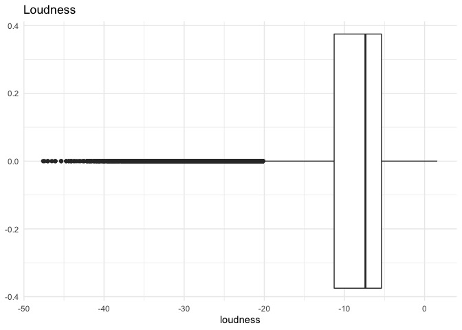

Spotify Predictive Analysis
================
Alejandro Cepeda
6/16/2022

## Context


Music (listening and playing) is one of my favorite pastimes and go-to
therapy session to de-stress. From a very young age, I have always
enjoyed diverse genres of music, which then prompted me to search for
and discover new genres I may enjoy. That of course could be a hit or
miss depending on what I discover. To combat the struggle of manually
conducting searches for new or previously unknown genres of music, I ask
the following question: **What determines a track’s genre category?**.
Knowing this may help me determine what makes a track enjoyable or not
based on my own tastes and hopefully others who read this! To answer
this, I downloaded a Spotify dataset from
[Kaggle.com](https://www.kaggle.com/datasets/zaheenhamidani/ultimate-spotify-tracks-db),
which was gathered using the Spotify API, mined, and saved by Kaggle
user Zaheen Hamidani. This dataset contains track information and the
audio features associated with their respective track, sourced from
Spotify’s API
[documentation](https://developer.spotify.com/documentation/web-api/reference/#/operations/get-audio-features):

## Data Description

-   **genre**: Song genre
-   **artist_name**: Song artist
-   **track_name**: Song name
-   **track_id**: Song unique ID
-   **popularity**: Song popularity (0-100) where higher is better
-   **acousticness**: A confidence measure from 0.0 to 1.0 of whether
    the track is acoustic. 1.0 represents high confidence the track is
    acoustic.
-   **danceability**: Describes how suitable a track is for dancing
    based on a combination of musical elements including tempo, rhythm
    stability, beat strength, and overall regularity. A value of 0.0 is
    least danceable and 1.0 is most danceable.
-   **duration_ms**: Duration of track in milliseconds
-   **energy**: Energy is a measure from 0.0 to 1.0 and represents a
    perceptual measure of intensity and activity. Typically, energetic
    tracks feel fast, loud, and noisy. For example, death metal has high
    energy, while a Bach prelude scores low on the scale. Perceptual
    features contributing to this attribute include dynamic range,
    perceived loudness, timbre, onset rate, and general entropy.
-   **instrumentalness**: Predicts whether a track contains no vocals.
    “Ooh” and “aah” sounds are treated as instrumental in this context.
    Rap or spoken word tracks are clearly “vocal”. The closer the
    instrumentalness value is to 1.0, the greater likelihood the track
    contains no vocal content. Values above 0.5 are intended to
    represent instrumental tracks, but confidence is higher as the value
    approaches 1.0.
-   **key**: The estimated overall key of the track. Integers map to
    pitches using standard Pitch Class notation . E.g. 0 = C, 1 = C#/D#,
    2 = D, and so on. If no key was detected, the value is -1.
-   **liveness**: Detects the presence of an audience in the recording.
    Higher liveness values represent an increased probability that the
    track was performed live. A value above 0.8 provides strong
    likelihood that the track is live.
-   **loudness**: The overall loudness of a track in decibels (dB).
    Loudness values are averaged across the entire track and are useful
    for comparing relative loudness of tracks. Loudness is the quality
    of a sound that is the primary psychological correlate of physical
    strength (amplitude). Values typical range between -60 and 0 db.
-   **mode**: Mode indicates the modality (major or minor) of a track,
    the type of scale from which its melodic content is derived. Major
    is represented by 1 and minor is 0.
-   **speechiness**: Speechiness detects the presence of spoken words in
    a track. The more exclusively speech-like the recording (e.g. talk
    show, audio book, poetry), the closer to 1.0 the attribute value.
    Values above 0.66 describe tracks that are probably made entirely of
    spoken words. Values between 0.33 and 0.66 describe tracks that may
    contain both music and speech, either in sections or layered,
    including such cases as rap music. Values below 0.33 most likely
    represent music and other non-speech-like tracks.
-   **tempo**: The overall estimated tempo of a track in beats per
    minute (BPM). In musical terminology, tempo is the speed or pace of
    a given piece and derives directly from the average beat duration.
-   **time_signature**: A measurement used in music to indicate meter,
    written as a fraction with the bottom number indicating the kind of
    note used as a unit of time and the top number indicating the number
    of units in each measure.
-   **valence**: A measure from 0.0 to 1.0 describing the musical
    positiveness conveyed by a track. Tracks with high valence sound
    more positive (e.g. happy, cheerful, euphoric), while tracks with
    low valence sound more negative (e.g. sad, depressed, angry).

## Packages and Data Collection

The following are the packages used throughout this project:

``` r
# libraries
library(tidyverse)
library(corrplot)
library(rsample)
library(broom)
library(yardstick)
library(nnet)
library(Metrics)
library(ranger)
library(tidymodels)
```

Let’s read in the dataset from the working directory:

``` r
# read in data
spotify <- read_csv("SpotifyFeatures.csv", show_col_types = FALSE)
glimpse(spotify)
```

    ## Rows: 232,725
    ## Columns: 18
    ## $ genre            <chr> "Movie", "Movie", "Movie", "Movie", "Movie", "Movie",…
    ## $ artist_name      <chr> "Henri Salvador", "Martin & les fées", "Joseph Willia…
    ## $ track_name       <chr> "C'est beau de faire un Show", "Perdu d'avance (par G…
    ## $ track_id         <chr> "0BRjO6ga9RKCKjfDqeFgWV", "0BjC1NfoEOOusryehmNudP", "…
    ## $ popularity       <dbl> 0, 1, 3, 0, 4, 0, 2, 15, 0, 10, 0, 2, 4, 3, 0, 0, 0, …
    ## $ acousticness     <dbl> 0.61100, 0.24600, 0.95200, 0.70300, 0.95000, 0.74900,…
    ## $ danceability     <dbl> 0.389, 0.590, 0.663, 0.240, 0.331, 0.578, 0.703, 0.41…
    ## $ duration_ms      <dbl> 99373, 137373, 170267, 152427, 82625, 160627, 212293,…
    ## $ energy           <dbl> 0.9100, 0.7370, 0.1310, 0.3260, 0.2250, 0.0948, 0.270…
    ## $ instrumentalness <dbl> 0.00e+00, 0.00e+00, 0.00e+00, 0.00e+00, 1.23e-01, 0.0…
    ## $ key              <chr> "C#", "F#", "C", "C#", "F", "C#", "C#", "F#", "C", "G…
    ## $ liveness         <dbl> 0.3460, 0.1510, 0.1030, 0.0985, 0.2020, 0.1070, 0.105…
    ## $ loudness         <dbl> -1.828, -5.559, -13.879, -12.178, -21.150, -14.970, -…
    ## $ mode             <chr> "Major", "Minor", "Minor", "Major", "Major", "Major",…
    ## $ speechiness      <dbl> 0.0525, 0.0868, 0.0362, 0.0395, 0.0456, 0.1430, 0.953…
    ## $ tempo            <dbl> 166.969, 174.003, 99.488, 171.758, 140.576, 87.479, 8…
    ## $ time_signature   <chr> "4/4", "4/4", "5/4", "4/4", "4/4", "4/4", "4/4", "4/4…
    ## $ valence          <dbl> 0.8140, 0.8160, 0.3680, 0.2270, 0.3900, 0.3580, 0.533…

## Data Cleaning

Prior to conducting EDA, there is already some preexisting knowledge
regarding the variables within the dataframe. Since this data was
gathered using an API, it is always a good practice to check for
duplicate observations (or rows) to ensure uniformity. The variables
`artist_name`, `track_name`, and `track_id` will not be needed for the
purpose of this project, thus the best course of action may be to remove
them. To conduct all of these data cleaning steps, I created a pipeline
using the dplyr’s `%>%` operator (loaded from the tidyverse package).

``` r
# pipeline to clean, drop and reformat variables
spotify_clean <- spotify %>%
  # remove duplicate tracks
  distinct(track_id, .keep_all=TRUE) %>%
  # select relevant variables
  select(-c(artist_name, track_name, track_id)) %>%
  # convert character variables to factor
  mutate(genre = as_factor(genre),
         time_signature = as_factor(time_signature),
         # convert duration to minutes instead
         duration_min = duration_ms/60000) %>%
  select(-duration_ms)
```

Based on prior musical knowledge (guitar and percussion classes), I
decided it is best to exclude `key`, `mode`, and `time_signature` from
the dataframe as they do not properly distinguish a genre as their
measurements often overlap, regardless of how a track sounds. The key,
as described in the [data description](#description), measures the pitch
the track was recorded in, which often only changes how high or low the
pitch will sound. The mode, labelled as either major or minor, may not
be specific enough for the classification models to properly
differentiate one from the other to predict a music genre. Time
signature will be used for further analysis as the tempo in which a
track is played may be useful for classifying a genre.

``` r
# drop mode and time signature
spotify_clean <- spotify_clean %>%
  select(-c(key, mode))
```

Before proceeding any further, inspecting the genres within the
dataframe may be helpful in the case of a misleading genre being
present.

``` r
# ensure genres are properly written
levels(spotify_clean$genre)
```

    ##  [1] "Movie"            "R&B"              "A Capella"        "Alternative"     
    ##  [5] "Country"          "Dance"            "Electronic"       "Anime"           
    ##  [9] "Folk"             "Blues"            "Opera"            "Hip-Hop"         
    ## [13] "Children's Music" "Children’s Music" "Rap"              "Indie"           
    ## [17] "Classical"        "Pop"              "Reggae"           "Reggaeton"       
    ## [21] "Jazz"             "Rock"             "Ska"              "Comedy"          
    ## [25] "Soul"             "Soundtrack"       "World"

``` r
# recode Children's Music genres as one
levels(spotify_clean$genre)[levels(spotify_clean$genre) == "Children’s Music"] <- "Children's Music"

# narrowing down genres for less memory usage
spotify_clean <- spotify_clean %>%
  filter(genre %in% c("Country","Electronic","Hip-Hop",
                      "Classical","Reggae","Reggaeton","Jazz"))

# verify recoding of levels
levels(spotify_clean$genre)
```

    ##  [1] "Movie"            "R&B"              "A Capella"        "Alternative"     
    ##  [5] "Country"          "Dance"            "Electronic"       "Anime"           
    ##  [9] "Folk"             "Blues"            "Opera"            "Hip-Hop"         
    ## [13] "Children's Music" "Rap"              "Indie"            "Classical"       
    ## [17] "Pop"              "Reggae"           "Reggaeton"        "Jazz"            
    ## [21] "Rock"             "Ska"              "Comedy"           "Soul"            
    ## [25] "Soundtrack"       "World"

Success! We can now continue with our cleaning process.

As the final step of the cleaning process, let’s check for any missing
values:

``` r
# check for missing data
colSums(is.na(spotify_clean))
```

    ##            genre       popularity     acousticness     danceability 
    ##                0                0                0                0 
    ##           energy instrumentalness         liveness         loudness 
    ##                0                0                0                0 
    ##      speechiness            tempo   time_signature          valence 
    ##                0                0                0                0 
    ##     duration_min 
    ##                0

Great news, 0 NAs were found!

## Exploratory Data Analysis

Now that our data is clean, we can conduct some EDA and determine
whether any further manipulation to be made on the data as well as
selecting the most appropriate features for the models.

``` r
# number of tracks per genre
spotify_clean %>%
  group_by(genre) %>%
  count() %>%
  arrange(n)
```

    ## # A tibble: 7 × 2
    ## # Groups:   genre [7]
    ##   genre          n
    ##   <fct>      <int>
    ## 1 Country     7383
    ## 2 Hip-Hop     7413
    ## 3 Jazz        8039
    ## 4 Reggaeton   8549
    ## 5 Reggae      8687
    ## 6 Classical   8711
    ## 7 Electronic  9149

``` r
# reorder variables
spotify_clean <- spotify_clean %>%
  # remove A Capella from data
  filter(!genre %in% c("A Capella","Anime","Children's Music","Movie","Soundtrack","World")) %>%
  droplevels() %>%
  select(genre, time_signature, everything())
```

### Feature Engineering

To ensure the data possesses proper center and spread, let’s take a look
at each possible features by genre. First let’s visualize the
distribution of each possible feature across all genres in the
dataframe:

``` r
# store numeric variable names in a vector
feature_names <- names(spotify_clean)[3:13]

# density plot of numeric features by genre
spotify_clean %>%
  select(c(genre, feature_names)) %>%
  # convert data to long format based on features
  pivot_longer(cols = feature_names) %>%
  ggplot(aes(x = value, fill = genre)) +
  geom_density() +
  facet_wrap(~name, ncol = 3, scales = "free") +
  labs(title = "Spotify Audio Feature Density Across Genres",
       x = "", y = "density") +
  theme(axis.text.x = element_text(size = 8, angle = 40),
        axis.text.y = element_blank(),
        legend.title = element_text(size=10),
        legend.key.size = unit(5, "mm"),
        legend.text = element_text(size=8))
```

<!-- -->

Based on the density plots above, `duration_min`, `instrumentalness`,
and `loudness` require normalization to ensure a well distributed
dataframe.

**Track Duration**

``` r
# look for outliers
spotify_clean %>%
  ggplot(aes(y = duration_min)) +
  geom_boxplot() + 
  coord_flip() +
  ggtitle("Duration (in minutes)")
```

<!-- -->

``` r
# store outliers based on 4th whisker
duration_outliers <- boxplot(spotify_clean$duration_min, 
                             plot = FALSE, range = 4)$out

# remove outliers
spotify_clean <- spotify_clean %>%
  filter(!duration_min %in% duration_outliers)

spotify_clean %>%
  ggplot(aes(y = duration_min)) +
  geom_boxplot() + 
  coord_flip() +
  ggtitle("Duration(in minutes) - no outliers")
```

<!-- -->

Since the boxplot with no outliers has better distribution, I stored the
new version of the dataset to reflect the `duration_outliers` not
present.

**Instrumentalness**

``` r
# look for outliers
spotify_clean %>%
  ggplot(aes(y = instrumentalness)) +
  geom_boxplot() +
  coord_flip() +
  ggtitle("Instrumentalness")
```

<!-- -->

``` r
# compare data w/ and w/o instrumentalness > 0
spotify_clean %>%
  filter(instrumentalness > 0.1) %>%
  ggplot(aes(y = instrumentalness)) +
  geom_boxplot() +
  coord_flip()
```

<!-- -->

``` r
# add all tracks w/o instrumentalness by genre
spotify_clean %>% 
  group_by(genre) %>%
  summarize(sum(instrumentalness == 0))
```

    ## # A tibble: 7 × 2
    ##   genre      `sum(instrumentalness == 0)`
    ##   <fct>                             <int>
    ## 1 Country                            3596
    ## 2 Electronic                          404
    ## 3 Hip-Hop                            4835
    ## 4 Classical                           320
    ## 5 Reggae                             3518
    ## 6 Reggaeton                          5102
    ## 7 Jazz                                813

From the yielded results above, I will remove `instrumentalness` as a
predictor variable due to the little influence it shows in terms of
classifying a genre.

``` r
spotify_clean <- spotify_clean %>%
  select(-instrumentalness)
```

**Loudness**

``` r
# look for outliers
spotify_clean %>%
  ggplot(aes(y = loudness)) +
  geom_boxplot() +
  coord_flip() +
  ggtitle("Loudness")
```

<!-- -->

``` r
# remove outliers
spotify_clean <- spotify_clean %>%
  filter(loudness < max(loudness))

# boxplot without outlier
spotify_clean %>%
  ggplot(aes(y = loudness)) +
  geom_boxplot() +
  coord_flip() +
  ggtitle("Loudness - no outliers")
```

<!-- --> The
only outlier from the `loudness` was the maximum valued observation in
the dataset, which was removed accordingly. **Time Signature**

``` r
# plot time_signature distribution
spotify_clean %>%
  ggplot(aes(x=time_signature)) +
  geom_bar()
```

<!-- -->

As can be seen in the plot above, a substantial number of tracks were
recorded to be in `4/4` meter, which can cause great bias during the
model training process. Based on inference and industry knowledge, I
will remove `time_signature` from the dataframe.

``` r
# drop time_signature
spotify_clean <- spotify_clean %>%
  select(-time_signature)
```

### Correlation

The final step prior to the modeling process is to find any features to
exclude with the help of a visualization of the correlations across all
numerical features. What we are looking for here are associations
between the features so any bias between multiple variables are avoided
when training and testing our model.

``` r
# correlation plot of numeric features
spotify_clean %>%
  select(-c(genre)) %>% 
  cor() %>%
  corrplot(method="number", type="upper", diag=FALSE,
           tl.col = "black", tl.cex=0.9, tl.srt=45)
```

<!-- -->

Loudness and energy possess the highest positive correlation (0.86),
therefore one must go in order to avoid prediction bias. Since `energy`
is much more evenly distributed compared to `loudness`, the latter will
be dropped from the final version of the full data frame.

``` r
# remove loudness
spotify_final <- spotify_clean %>%
  select(-loudness)
```

## Data Preparation

The final step before training our models is to create training,
testing, and validation sets of the final version of the dataset. Since
there is a random aspect to this step, a rule of thumb I learned is to
set the seed of the current random number generator (RNG) state to any
desired number to ensure the “random” component is properly done. Then,
we create a 75%/25% split of our `spotify_final` dataset and proceed to
create the training and testing sets with this split using the
`training` and `testing` functions from the `rsample` package. Next, we
create a 10-fold cross validation split for later training. Finally, the
cross-validated split is used to create training and testing sets from
within the dataset as `cv_data`. This allows us to essentially store a
dataframe within a dataframe with the help of the `broom` package.

``` r
set.seed(123)
# creating create initial split 
spotify_split <- initial_split(spotify_final, prop=0.75)

# create train and test sets
spotify_train <- training(spotify_split)
spotify_test <- testing(spotify_split)

# create 10 fold cv split
cv_split <- vfold_cv(spotify_train, v=10)

# store cv dataset
cv_data <- cv_split %>%
  mutate(train = map(splits, ~training(.x)),
         validate = map(splits, ~testing(.x)))

glimpse(cv_data)
```

    ## Rows: 10
    ## Columns: 4
    ## $ splits   <list> [<vfold_split[38539 x 4283 x 42822 x 10]>], [<vfold_split[38…
    ## $ id       <chr> "Fold01", "Fold02", "Fold03", "Fold04", "Fold05", "Fold06", "…
    ## $ train    <list> [<tbl_df[38539 x 10]>], [<tbl_df[38539 x 10]>], [<tbl_df[385…
    ## $ validate <list> [<tbl_df[4283 x 10]>], [<tbl_df[4283 x 10]>], [<tbl_df[4282 …

The `train` and `validate` (for predictions) columns are stored as lists
of multiple data frames for each respective split fold. Let’s ensure
these are properly stored with their supposed variables in place.

``` r
# training first fold set
glimpse(cv_data$train[[1]])
```

    ## Rows: 38,539
    ## Columns: 10
    ## $ genre        <fct> Jazz, Country, Reggae, Reggae, Reggaeton, Country, Reggae…
    ## $ popularity   <dbl> 34, 35, 36, 38, 59, 37, 28, 45, 26, 37, 67, 58, 46, 0, 36…
    ## $ acousticness <dbl> 0.966000, 0.685000, 0.208000, 0.070500, 0.183000, 0.18200…
    ## $ danceability <dbl> 0.624, 0.574, 0.785, 0.625, 0.819, 0.639, 0.768, 0.327, 0…
    ## $ energy       <dbl> 0.18600, 0.60100, 0.37100, 0.44500, 0.55000, 0.65800, 0.8…
    ## $ liveness     <dbl> 0.0921, 0.0412, 0.0448, 0.4850, 0.3200, 0.1290, 0.0674, 0…
    ## $ speechiness  <dbl> 0.0460, 0.0461, 0.0824, 0.0458, 0.0695, 0.0618, 0.0996, 0…
    ## $ tempo        <dbl> 78.682, 148.935, 82.913, 79.386, 108.980, 93.019, 134.838…
    ## $ valence      <dbl> 0.4300, 0.7730, 0.9270, 0.6160, 0.8530, 0.5770, 0.4310, 0…
    ## $ duration_min <dbl> 6.645333, 2.682883, 3.414000, 2.542667, 3.259783, 4.63621…

``` r
# validation first fold set
glimpse(cv_data$validate[[1]])
```

    ## Rows: 4,283
    ## Columns: 10
    ## $ genre        <fct> Reggaeton, Reggae, Electronic, Reggae, Hip-Hop, Reggaeton…
    ## $ popularity   <dbl> 26, 42, 35, 50, 69, 35, 32, 37, 34, 51, 23, 21, 66, 62, 3…
    ## $ acousticness <dbl> 0.556000, 0.185000, 0.190000, 0.008210, 0.089600, 0.13100…
    ## $ danceability <dbl> 0.787, 0.579, 0.821, 0.812, 0.780, 0.715, 0.538, 0.896, 0…
    ## $ energy       <dbl> 0.396, 0.567, 0.287, 0.653, 0.729, 0.660, 0.898, 0.592, 0…
    ## $ liveness     <dbl> 0.1150, 0.1220, 0.1260, 0.0708, 0.1040, 0.1100, 0.5220, 0…
    ## $ speechiness  <dbl> 0.0979, 0.0307, 0.0830, 0.0346, 0.0493, 0.1970, 0.0502, 0…
    ## $ tempo        <dbl> 129.961, 87.010, 81.044, 94.979, 123.009, 89.604, 171.987…
    ## $ valence      <dbl> 0.226, 0.333, 0.834, 0.740, 0.844, 0.693, 0.637, 0.286, 0…
    ## $ duration_min <dbl> 4.061533, 2.804600, 1.629167, 3.376517, 4.172283, 2.87845…

## Modeling

### Logistic Regression

``` r
# build multinom logistic regression model
cv_models_mlr <- cv_data %>%
  mutate(model = map(train, ~multinom(genre~., data=.x)))
```

    ## # weights:  77 (60 variable)
    ## initial  value 74993.431234 
    ## iter  10 value 69761.659633
    ## iter  20 value 53919.499855
    ## iter  30 value 48856.430437
    ## iter  40 value 44940.874385
    ## iter  50 value 42903.490027
    ## iter  60 value 42414.818703
    ## iter  70 value 42227.495347
    ## final  value 42225.217295 
    ## converged
    ## # weights:  77 (60 variable)
    ## initial  value 74993.431234 
    ## iter  10 value 69848.357609
    ## iter  20 value 53475.052293
    ## iter  30 value 47999.369400
    ## iter  40 value 45066.456407
    ## iter  50 value 42967.063667
    ## iter  60 value 42450.514024
    ## iter  70 value 42301.386065
    ## final  value 42299.466532 
    ## converged
    ## # weights:  77 (60 variable)
    ## initial  value 74995.377145 
    ## iter  10 value 69606.812015
    ## iter  20 value 54249.310561
    ## iter  30 value 48245.335121
    ## iter  40 value 44729.531757
    ## iter  50 value 42910.995443
    ## iter  60 value 42403.174547
    ## iter  70 value 42260.123343
    ## final  value 42257.811274 
    ## converged
    ## # weights:  77 (60 variable)
    ## initial  value 74995.377145 
    ## iter  10 value 69789.627650
    ## iter  20 value 55417.716764
    ## iter  30 value 48827.610416
    ## iter  40 value 45471.868423
    ## iter  50 value 42986.279169
    ## iter  60 value 42432.139489
    ## iter  70 value 42286.843340
    ## iter  80 value 42285.679718
    ## final  value 42285.678177 
    ## converged
    ## # weights:  77 (60 variable)
    ## initial  value 74995.377145 
    ## iter  10 value 69923.365198
    ## iter  20 value 57046.653568
    ## iter  30 value 48954.627638
    ## iter  40 value 44680.656516
    ## iter  50 value 42954.400504
    ## iter  60 value 42501.191262
    ## iter  70 value 42318.075886
    ## final  value 42316.422994 
    ## converged
    ## # weights:  77 (60 variable)
    ## initial  value 74995.377145 
    ## iter  10 value 69769.578317
    ## iter  20 value 53469.904469
    ## iter  30 value 47935.133531
    ## iter  40 value 44705.046025
    ## iter  50 value 42915.072598
    ## iter  60 value 42375.725414
    ## iter  70 value 42236.183157
    ## final  value 42234.220055 
    ## converged
    ## # weights:  77 (60 variable)
    ## initial  value 74995.377145 
    ## iter  10 value 69791.891236
    ## iter  20 value 54885.949275
    ## iter  30 value 49924.528142
    ## iter  40 value 45441.737450
    ## iter  50 value 43130.047186
    ## iter  60 value 42508.380330
    ## iter  70 value 42271.095496
    ## iter  80 value 42267.812127
    ## final  value 42267.810792 
    ## converged
    ## # weights:  77 (60 variable)
    ## initial  value 74995.377145 
    ## iter  10 value 69923.674445
    ## iter  20 value 54697.526585
    ## iter  30 value 49172.382165
    ## iter  40 value 45686.317122
    ## iter  50 value 43022.372059
    ## iter  60 value 42482.136625
    ## iter  70 value 42331.550313
    ## iter  80 value 42330.561215
    ## final  value 42330.559362 
    ## converged
    ## # weights:  77 (60 variable)
    ## initial  value 74995.377145 
    ## iter  10 value 69985.022668
    ## iter  20 value 53996.823900
    ## iter  30 value 48970.057573
    ## iter  40 value 45044.341367
    ## iter  50 value 42984.557642
    ## iter  60 value 42555.186640
    ## iter  70 value 42342.457506
    ## final  value 42339.849528 
    ## converged
    ## # weights:  77 (60 variable)
    ## initial  value 74995.377145 
    ## iter  10 value 70080.570161
    ## iter  20 value 55616.919984
    ## iter  30 value 49199.117472
    ## iter  40 value 44969.796949
    ## iter  50 value 42882.848040
    ## iter  60 value 42405.314323
    ## iter  70 value 42245.565559
    ## final  value 42243.710316 
    ## converged

**Model Performance**

``` r
# Prepare actual test set classes
mlr_test_actual <- spotify_test$genre

# Prepare vector of predicted values
mlr_test_predicted <- predict(cv_models_mlr$model[[2]], spotify_test, type = "class")
```

**Test Set Performance**

``` r
# Compare the actual & predicted performance visually using a table
table(mlr_test_actual, mlr_test_predicted)
```

    ##                mlr_test_predicted
    ## mlr_test_actual Country Electronic Hip-Hop Classical Reggae Reggaeton Jazz
    ##      Country       1070        194      48        41     91        99  277
    ##      Electronic     228       1256     109        75    202       317  118
    ##      Hip-Hop         95         71    1582         0     39        69   41
    ##      Classical       45        123       0      1654      4         2  142
    ##      Reggae         170        274     104        15   1090       409  136
    ##      Reggaeton      118        221     212         5    334      1109   58
    ##      Jazz           226        201      45       252    308       184  811

``` r
# Calculate the accuracy
accuracy(mlr_test_actual, mlr_test_predicted)
```

    ## [1] 0.6005324

### Random Forest

``` r
# determine tuning params before modeling
cv_tune_rf <- cv_data %>%
  crossing(mtry = c(1:5))

# build rf model
cv_models_rf <- cv_tune_rf %>% 
  mutate(model = map2(train, mtry, ~ranger(formula = genre~., 
                                           data = .x, mtry = .y,
                                           num.trees = 100, seed = 123)))
```

**Model Tuning**

``` r
# Generate validate predictions for each model
cv_prep_rf <- cv_models_rf %>% 
  mutate(validate_actual = map(validate, ~.x$genre),
         validate_predicted = map2(.x = model, .y = validate, 
                                   ~predict(.x, .y, type = "response")$predictions))

# Calculate the validate recall for each cross validation fold
cv_perf_acc_rf <- cv_prep_rf %>% 
  mutate(validate_acc = map2_dbl(validate_actual, validate_predicted, 
                                    ~accuracy(actual = .x, predicted = .y)))

# Calculate the mean recall for each mtry used  
cv_perf_acc_rf %>% 
  group_by(mtry) %>% 
  summarize(mean_acc = mean(validate_acc))
```

    ## # A tibble: 5 × 2
    ##    mtry mean_acc
    ##   <int>    <dbl>
    ## 1     1    0.688
    ## 2     2    0.692
    ## 3     3    0.692
    ## 4     4    0.691
    ## 5     5    0.689

**Model Performance**

``` r
# Build the logistic regression model using all training data
rf_best_model <- ranger(genre~., data = spotify_train, 
                     num.trees = 500, mtry = 2)

# Prepare binary vector of actual Attrition values for testing_data
rf_test_actual <- spotify_test$genre

# Prepare binary vector of predicted Attrition values for testing_data
rf_test_predicted <- predict(rf_best_model, spotify_test, type = "response")$predictions
```

**Test Set Performance**

``` r
# Compare the actual & predicted performance visually using a table
table(rf_test_actual, rf_test_predicted)
```

    ##               rf_test_predicted
    ## rf_test_actual Country Electronic Hip-Hop Classical Reggae Reggaeton Jazz
    ##     Country       1312        128      34         4     80        73  189
    ##     Electronic     158       1522      97        29    192       161  146
    ##     Hip-Hop         45         47    1676         0     42        62   25
    ##     Classical       16        108       1      1716      2         2  125
    ##     Reggae         139        218     114         7   1240       346  134
    ##     Reggaeton       77        142     211         1    243      1337   46
    ##     Jazz           164        192      40       161    208       137 1125

``` r
# Calculate the test accuracy
accuracy(rf_test_actual, rf_test_predicted)
```

    ## [1] 0.6955303

### Model Comparison

**Multinomial Logistic Regression**

``` r
# store multinom confusion matrix
mlr_confmat <- as.data.frame(table(mlr_test_actual, mlr_test_predicted))

# visualize confusion matrix
mlr_confmat %>%
  ggplot(aes(mlr_test_actual, mlr_test_predicted)) +
  geom_tile(aes(fill = Freq)) +
  geom_text(aes(label = sprintf("%1.0f", Freq)), vjust = 1) +
  scale_fill_gradient(low = "white",
                      high = "red") +
  labs(x = "Actual", y = "Predicted")
```

<!-- -->

**Random Forest**

``` r
# store random forest confusion matrix
rf_confmat <- as.data.frame(table(rf_test_actual, rf_test_predicted))

# visualize confusion matrix
rf_confmat %>%
  ggplot(aes(rf_test_actual, rf_test_predicted)) +
  geom_tile(aes(fill = Freq)) +
  geom_text(aes(label = sprintf("%1.0f", Freq)), vjust = 1) +
  scale_fill_gradient(low = "white",
                      high = "red") +
  labs(x = "Actual", y = "Predicted")
```

<!-- -->

## Conclusion and Further Steps

-   Encode genres into less categories (genres in this case)
-   More data, builds on encoding, to have more rows with less labels in
    our response variable (variable to predict), thus less memory usage
    and faster run time.
-   Utilize variable importance to reduce number of irrelevant
    predictors.
